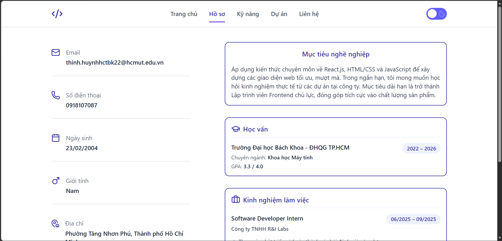
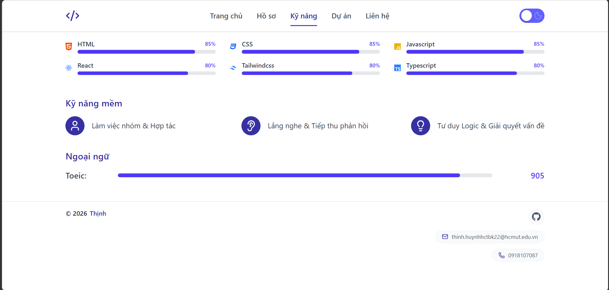

# Personal Portfolio Website

Một trang Portfolio cá nhân hiện đại, trực quan, hiệu năng cao và có tính tương tác tốt được xây dựng bằng **React**, **TypeScript**, **Vite** và **Tailwind CSS**.

---

## Tech Stack

Dự án sử dụng các công nghệ hiện đại và tối ưu:

- **Core**: [React 19](https://react.dev/), [TypeScript](https://www.typescriptlang.org/)
- **Build Tool**: [Vite 8](https://vite.dev/) (khởi tạo nhanh, HMR tức thì)
- **Styling**: [Tailwind CSS v4](https://tailwindcss.com/) (phong cách Utility-first, tối ưu build size)
- **Routing**: [React Router DOM v7](https://reactrouter.com/) (điều hướng client-side mượt mà)
- **Animation**: [Framer Motion v13](https://motion.dev/) (hoạt ảnh chuyển trang, stagger effects sinh động)
- **Icons**: [Lucide React](https://lucide.dev/) & [React Icons](https://react-icons.github.io/react-icons/)
- **Linter**: [Oxlint](https://oxc.rs/docs/guide/usage/linter/introduction.html) (linter tốc độ cực nhanh cho JS/TS)

---

## Hướng dẫn chạy dự án

Làm theo các bước dưới đây để chạy thử dự án ở môi trường Local của bạn:

### 1. Cài đặt các gói phụ thuộc (Dependencies)
```bash
npm install
```

### 2. Chạy dự án ở chế độ Development
```bash
npm run dev
```
Sau đó mở trình duyệt và truy cập: [http://localhost:5173](http://localhost:5173)

### 3. Build sản phẩm cho môi trường Production
```bash
npm run build
```

### 4. Chạy thử bản build Production
```bash
npm run preview
```

---

## Các tính năng nổi bật đã thực hiện

1. **Routing linh hoạt (`react-router-dom`)**:
   - Hệ thống định tuyến client-side nhanh chóng qua các trang: *Trang chủ*, *Thông tin cá nhân (Resume)*, *Kỹ năng*, *Dự án*, *Liên hệ*.
   - Hỗ trợ xử lý lỗi trang không tìm thấy (Trang 404 - NotFound).
   - Tự động cuộn lên đầu trang khi chuyển hướng thông qua component `ScrollToTop`.

2. **Hoạt ảnh & Chuyển động (`framer-motion`)**:
   - Chuyển trang mượt mà nhờ hiệu ứng fade/slide kết hợp cấu hình `AnimatePresence (mode="wait")`.
   - Các hiệu ứng Staggered Fade-in trên danh sách dự án và kỹ năng giúp tạo cảm giác mượt mà và trực quan.
   - Hover effects cao cấp trên các thẻ dự án (Zoom nhẹ, đổi viền, đổ bóng).

3. **Lọc và tìm kiếm dự án (Filter & Search)**:
   - Cho phép tìm kiếm dự án trực tiếp bằng từ khóa theo tên.
   - Bộ lọc tag thông minh theo từng công nghệ (ví dụ: React, TypeScript, Tailwind...) giúp người xem dễ dàng tìm thấy các dự án tương quan.
   - Giao diện phản hồi thân thiện khi không tìm thấy kết quả phù hợp.

4. **Biểu mẫu Liên hệ có xác thực (Form Validation & Feedback)**:
   - Ràng buộc thông tin đầu vào rõ ràng:
     - Họ tên: không được để trống.
     - Email: bắt buộc và phải đúng định dạng email tiêu chuẩn.
     - Tiêu đề: không được để trống.
     - Nội dung: tối thiểu 20 ký tự.
   - Hiệu ứng loading dạng spinner khi gửi và hiển thị thông báo Toast thành công cực kỳ trực quan sau khi xử lý thành công.

5. **Giao diện sáng/tối (Dark / Light Mode)**:
   - Hỗ trợ giao diện sáng và tối tùy biến thông qua custom hook `useTheme`.
   - Trạng thái giao diện được lưu trữ cục bộ (`localStorage`) để duy trì chế độ hiển thị ưa thích của người dùng ở lần truy cập sau.

---

## Demo & Screenshots

### Link Demo trực tuyến
https://youtu.be/kxR17SH02oY

### Hình ảnh giao diện dự án

#### 1. Trang chủ và thông tin dự án


#### 2. Trang liên hệ và quản lý kỹ năng


### Link Vercel
https://canhthinhportfolio.vercel.app/